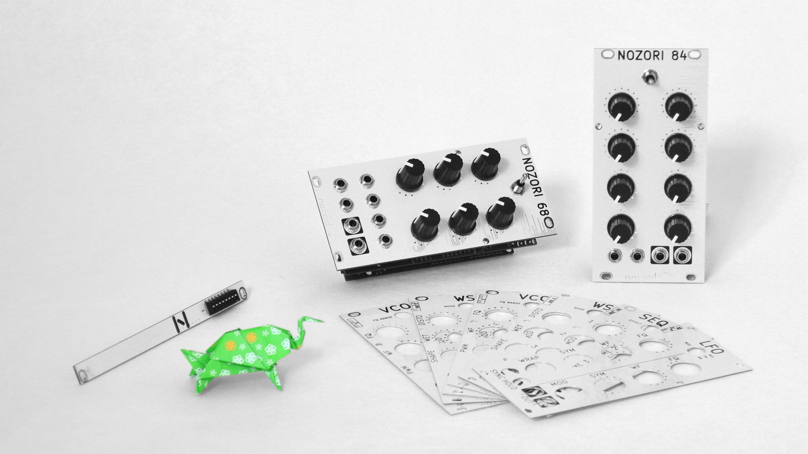

# Nozori modules for VCVRack
This is a port of nozori eurorack module for VCV Rack. This emulation are based on the same firmware as the nozori hardware made by nozoïd.

A single Nozori module allow to switch between all this firmware.

http://nozoid.com/nozori/ : documentation and demo videos about this modules. 

https://vcvrack.com/

## Nozori 68 module list :
- ### Audio sources
  - VCO PARAMETRIC
  - VCO MOD
  - VCO QUANTIZED
  - VCO WAVESHAPER
  - VCO LOOP
  - NOISE
  - KARPLUS-STRONG
- ### Audio effects
  - VCF PARAMETRIC
  - VCF MULTIMODE
  - VCA/PAN
  - BIT CRUSH
  - PITCH SHIFT
  - DELAY
  - GRANULATOR
  - SIN MOD
  - WAVE-SHAPER
  - EQ
- ### CV generator and manipulator
  - LFO DUAL
  - LFO MOD
  - ADSR / VCA
  - AR
  - RND LOOP
  - CV REC
   
## Nozori 84 module list :
- ### Audio sources
  - VCO HARMO
  - VCO ADDITIVE
  - OSC PARAMETRIC
  - SIN FM
  - SIN FM LIN
  - SIN AM
  - SIN PM
  - VCO FM
  - THOMAS CHAOS
  - PETER de JONG VCO
  - SIN Wave Shaper
  - 8 BITS
- ### Audio effects
  - VCF PARAMETRIC
  - STEREO WS
  - DOPPLER
  - MODULATE
- ### CV generator and manipulator
  - LFO
  - LFO SEQ
  - ADSR LOOP
  - CLOCK / ADSR / VCA
  - SEQ 4
  - SEQ 8
  - PETER de JONG LFO

Most module need a 96KHz sampling rate. Few other need 48KHz sampling rate. Using an other frequency is not recomended.
